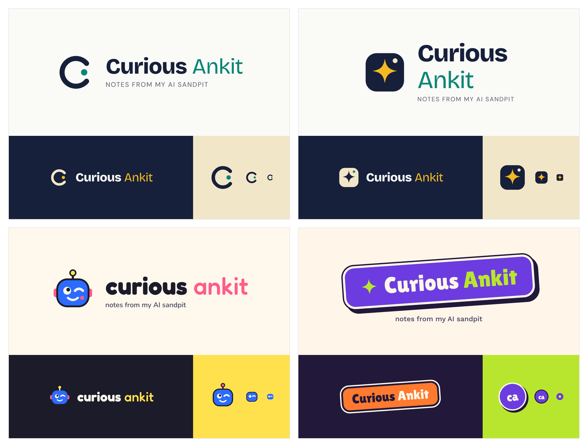
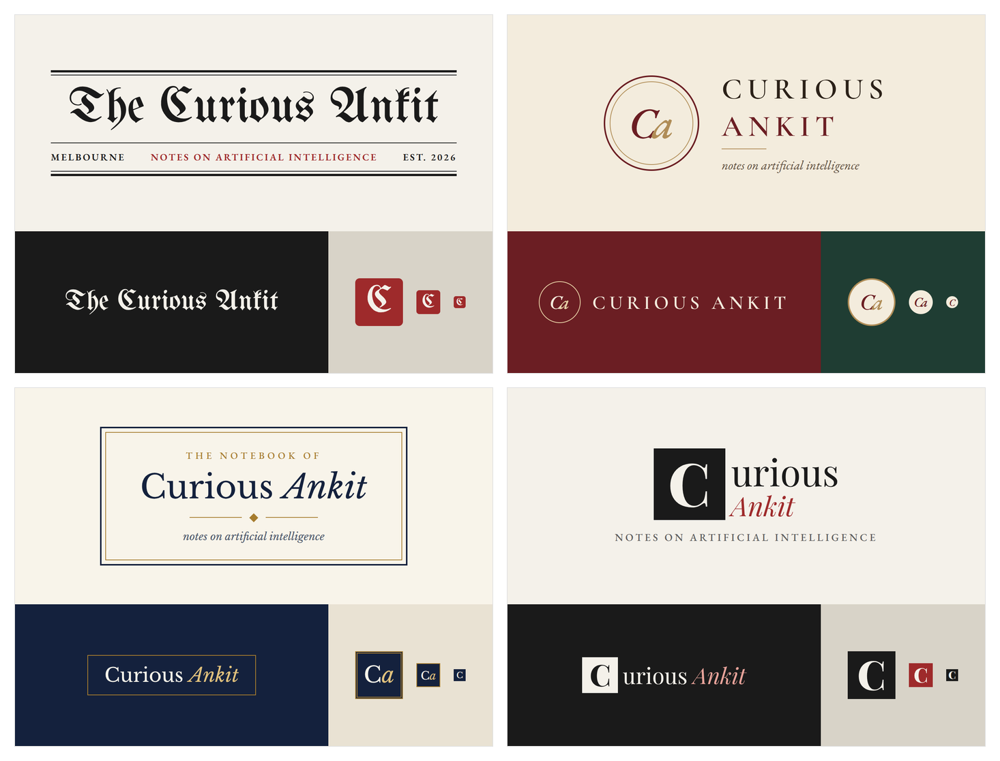
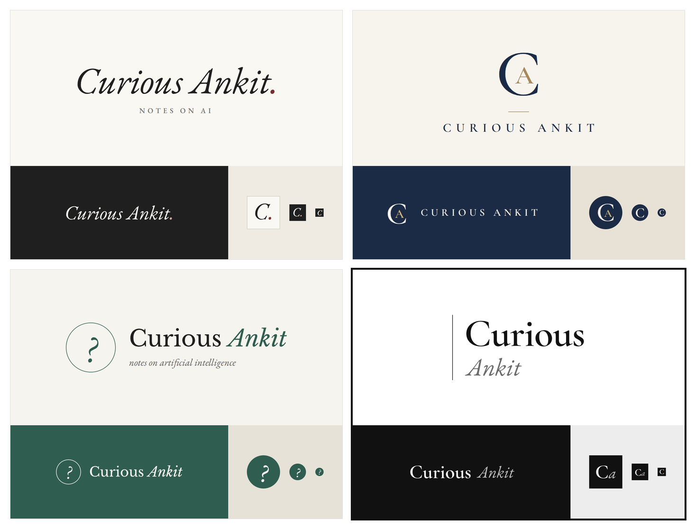
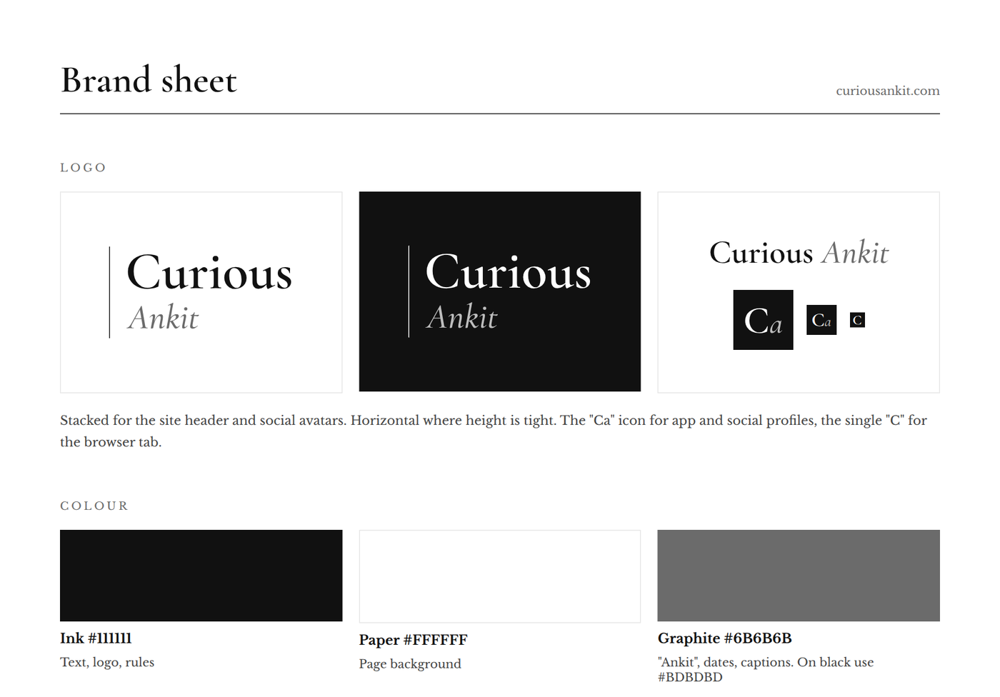
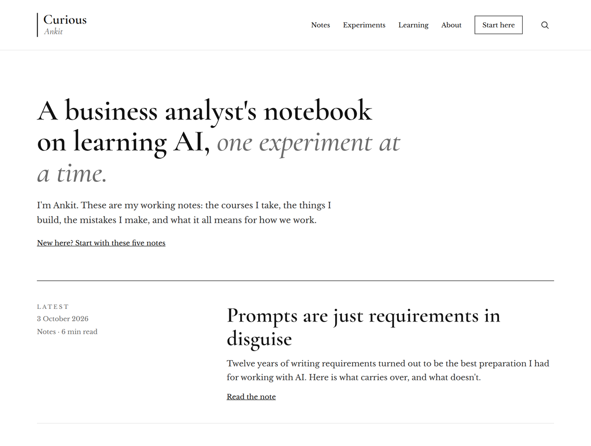
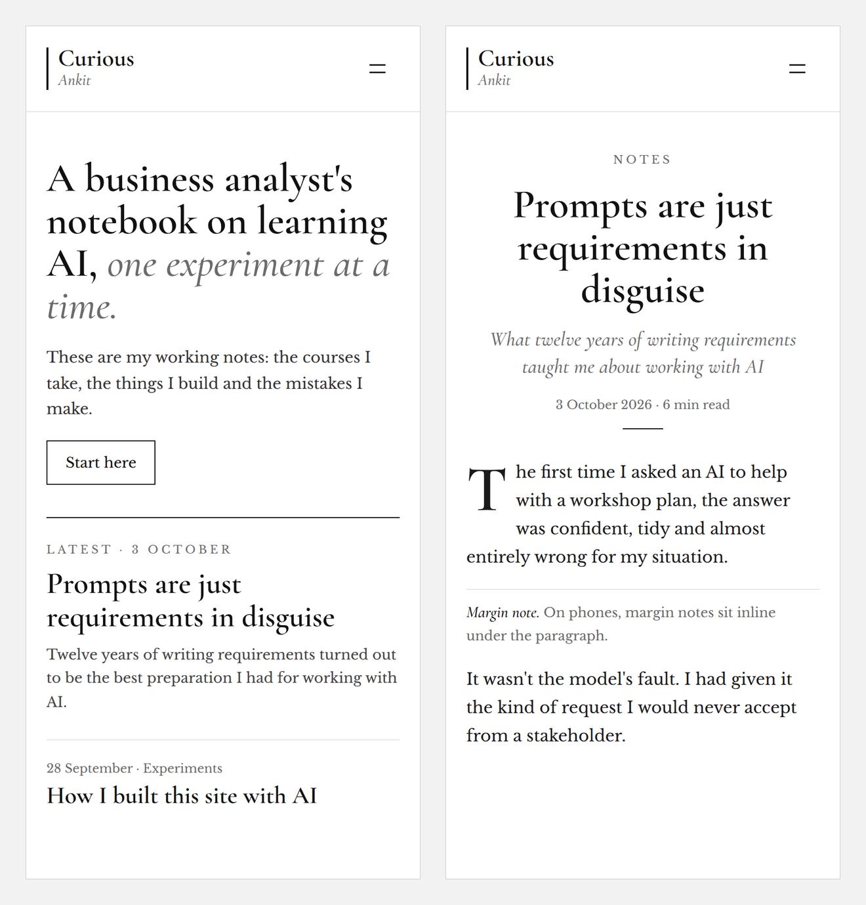

The question behind this experiment was simple. Could I run a website the way I run a project at work, with a brief, options to react to, a specification, a build, testing and a release, and let AI do the delivery? You are reading the answer.

<aside class="note"><em>Margin note.</em> I had planned to build this with Claude Code. In the end I used an ordinary chat window and ran every command myself.</aside>

By delivery I mean that Claude wrote the code and the commands. I decided what I wanted, ran each command in Terminal, and sent back screenshots when something broke. This note is the retrospective.

## The brief

I began with a plain request. I wanted to document my AI learning as a blog: the experiments, the courses, and what I find along the way. I already had a personal site, ank1t.com, and I wanted this one to be separate. A place for notes and for having fun, not a polished portfolio.

<aside class="note"><em>Margin note.</em> A first answer is a draft. Pushing back cost me one sentence.</aside>

The first thing the AI did was disagree. It suggested keeping everything on my existing site, so my search presence stayed in one place. I said I wanted a separate site, and it changed its recommendation straight away.

The name went the same way. The AI offered shortlists. The names I liked most were priced as premium domains, and I could not choose between the two that were left. The name I finally picked, curiousankit.com, was my own suggestion, not one of theirs.

## Reacting to options, not describing a design

I never wrote a style guide. I asked for directions and reacted to them. Over four rounds I looked at fifteen logo concepts, and I rejected fourteen of them.

The first round was professional. The second was playful, with robots, question marks and stickers, and it was too playful.

<figure class="shot wide">



<figcaption>Rejected, rounds one and two. Two from the professional start and two from the playful turn: Curious Eye, Sandpit Spark, Doodle Bot and Laptop Sticker.</figcaption>
</figure>

The third round borrowed from newspapers and novels, and it was too literally a newspaper.

<figure class="shot wide">



<figcaption>Rejected, round three. The Masthead, The Colophon, The Bookplate and The Drop Cap.</figcaption>
</figure>

One message turned it around.

<figure class="prompt">
<figcaption>The feedback that fixed the brand</figcaption>

```text
The logos are too newspaper like. I like the typography options. I want the colour palette to be simple and the logo to be classy.
```

</figure>

It says what to keep, what to drop and what I want instead, which is the same shape as good feedback on any prototype. The fourth round was the shortlist.

<figure class="shot wide">



<figcaption>The final round: The Signature, The Monogram, The Question and The Stack. The Stack, outlined, won.</figcaption>
</figure>

The final choices were a stacked wordmark with a thin vertical rule, a palette of black, white and grey, Cormorant Garamond for titles and Libre Baskerville for body text.

<figure class="shot wide">



<figcaption>The chosen brand: the logo, the Ca icon and three colours.</figcaption>
</figure>

> I did not describe the site I wanted. I reacted until one felt right.

## Why I chose Astro

Choosing the platform was the same exercise with a different cast. These were the options I looked at, and why each one lost.

<aside class="note"><em>Margin note.</em> Prices and plans here are as I found them in October 2026. They change, so check before you rely on them.</aside>

* **WordPress.** I had used it before and did not enjoy it.
* **Ghost.** It has the best writing editor of the lot, but Ghost's own hosting was too expensive. Cheaper hosts exist, and I looked at them, but they hand more of the running of the site to you.
* **Bear Blog and Pika.** Both looked too basic for the brand I had just chosen.
* **Hashnode.** A custom domain sat behind a paid plan, and the design is mostly fixed. It also leans towards a developer audience, and my angle is AI from a business analyst's side.

I also looked at Quartz, a free way to publish notes from Obsidian, and decided against it.

<!-- Ankit: add one sentence on why you passed on Quartz. -->

The deciding question was what mattered most. For me it was the reader's experience and a site that is truly mine. That is a real trade. The AI's own summary was that Ghost wins if you want a lovely editor and no upkeep, and Astro wins if the reading experience and ownership matter most.

It also helped that I liked the idea of building a site about learning AI with the help of AI.

What I gave up was real. I write in plain text files, not in a polished editor. Things that Ghost includes, such as search, dark mode, a newsletter form and share images, I had to add one by one, and two of them are still missing: the email signup and the share image. And the updates are mine to look after.

What I got was control. Because no theme stood between me and the page, I could ask for the artboard to be followed closely, and it was.

## The artboard became the specification

From the chosen brand we built mockups of the home page and a post page, on desktop and on a phone, including the margin notes used in this post.

<figure class="shot wide">



<figcaption>The artboard: the home page on desktop. The notes shown are placeholders.</figcaption>
</figure>

<figure class="shot wide">



<figcaption>The same design on a phone: the home page and a post, with placeholder notes.</figcaption>
</figure>

Those mockups became the specification. When the first version of the site went up with the template's layout and my fonts, I gave one instruction: follow the artboard for the look and feel, the menu, the layouts, the typography, the logos and the icons. The pages were rebuilt to match.

Every specification has gaps, and this one did too. It showed an email signup form, a list of courses and a LinkedIn link, but not where the signups would go, which courses I was taking or what my LinkedIn address was. Rather than put made up content on a live site, we hid those parts until the real details exist. It is the choice I would make on any project: name the gap and leave it visibly open, instead of papering over it.

## Build day

The build happened on a Sunday afternoon. By just before four, the site was live on my own domain, and email at that domain was working. By about five, the full design was running.

The steps, in order, were to register the domain at Cloudflare, set up email on it through iCloud, create a GitHub account, install the tools, create the Astro project, push it to GitHub, connect that to Cloudflare and attach the domain. Each one was a short conversation. Several of them went wrong at least once.

### What went wrong

<aside class="note"><em>Margin note.</em> My first test emails landed in Spam. A brand new domain has no history, so filters distrust it. Moving them to the Inbox taught the filter.</aside>

The small failures were easy. The GitHub page offered an install command for a tool my Mac did not have, so we used a direct download instead.

The odder one was pasting. Long blocks of commands pasted into Terminal went wrong in a way I could not see, and one page of the site ended up holding another page's text. I never found the exact cause. The fix was to stop pasting and receive the files as a download to unzip.

The most instructive failure was the quietest. My first push to GitHub did not save the link between my computer and the repository, so later pushes failed and nothing reached the site. The AI had told me the site would update within a couple of minutes. It did not. The dashboard was right and the assurance was wrong, and I only found the problem because I looked at Cloudflare and reported what I saw, which was nothing new.

What made all of this fixable was screenshots. I rarely described an error. I sent a picture of it, and the AI read it and told me what to do next. Evidence beats description.

## Where my judgement mattered

Most of what the AI produced was plausible. My job was to notice what was not right.

* **The author box.** Every post ended with a "Written by Ankit" box, because blogs usually have one. I asked whether it was needed on a site where I am the only author. It was not, and it went.
* **The sentence that meant nothing.** The home page said my notes were about "what it all means for how we work". I could not tell what that meant. It had come from the mockup, and you can see it in the screenshot above, where it sounds good while saying little. I replaced it with a plainer line: "and what I learn along the way."
* **The duplicate link.** My other site was linked from both the About page and the footer. I spotted the repeat and one of them went.
* **The menu names.** "Courses" implied I was selling courses, so it became "Learning". "Blog" became "Notes".

None of these were bugs. Each was something a reviewer catches, and each time the reviewer was me.

## What I would take from it

For other business analysts, six things:

1. **Treat the first answer as a draft.** Disagreeing was cheap, and it worked.
2. **Show, do not describe.** Reacting to options got me further than any brief I could have written up front.
3. **Choose the platform by what you will not compromise on.** For me it was the reading experience and owning the site, and the rest followed.
4. **Make the specification a picture, then point at it.** One instruction rebuilt the whole site.
5. **Trust the system, not the assurance.** The dashboard told the truth when the confident reply did not.
6. **Read generated copy the way a stakeholder would.** If you cannot say what a sentence means, neither can your reader.

That is the experiment. The site is the evidence.

<!--
Ankit, before publishing, add your own reflection near the end: what surprised you,
what you would do differently, and whether you would try Claude Code next time.
You can also add what the domain cost. Delete this comment when you are done.
-->
